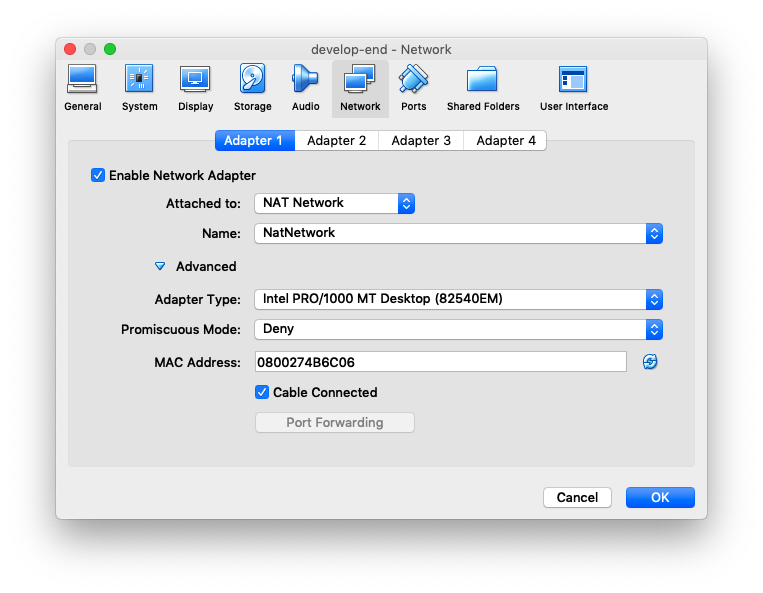

# **Xinu-on-Virtualbox**
> *An updated version-controlled guide, based on official Purdue & Syracuse University documentation: [How-to-install_Xinu-on-VirtualBox](pdf/How-to-install_Xinu-on-VirtualBox.pdf)*

## **Virtual Box**
1. Install the latest 5.2.X branch of Virtual Box on your OS 
  
>  *Compatability issues including 32-bit support and ongoing development with 6.X versions make the results less stable. This guide tested using VBox version 5.2.32r132073*

2. Download and extract the tarball of the two virtual machines you'll need to develop Xinu: [xinu-vbox-appliances](ftp://ftp.cs.purdue.edu/pub/comer/private/Xinu/xinu-vbox-appliances.tar.gz)

>  *Xinu runs in this configuration on the back-end machine built to boot from a private network hosted on the develop-end machine, using the pre-build image that is also hosted on develop-end and made available via sftp*

3. Import both VM's into VBox, using default settings and changing no options.

>  *At this point, you'll be able to run the machines and develop, but only through the VBox interface. To make things easier, continue on and configure the develop-end machine for SSH, allowing remote shell access from multiple terminals and any location*

## **Network Configuration**
### **Virtual Networks**
1. To configure SSH we need to configure some networks. Open up a command line on YOUR host machine (the one VBox is installed on), and type `VBoxManage natnetwork add --netname NatNetwork2 --network 192.168.56.0/24 --enable --port-forward-4 "ssh:tcp:[]:2022:[192.168.56.5]:22"`

2. Next type "VBoxManage natnetwork list" to confirm your results. You should see the following:
```
NAT Networks:

Name:        NatNetwork
Network:     192.168.56.0/24
Gateway:     192.168.56.1
IPv6:        No
Enabled:     Yes

1 network found
```

3. If all the above executed without error, we can go on to adding network interfaces to the VM.

### **Virtual Machine Interfaces**
1. First off, make sure both VM's are powered off, then open the settings for develop-end

2. Under the settings, go to "Network". There should be one adapter already configured. DO NOT CHANGE IT!!! Your sftp server and back-end rely on the predefined settings and MAC address to function. Choose an unused network adapter and enable it.

3. Under the now clickable adapter settings, choose "Attached to: NAT Network", and " Name: NatNetwork" from the drop-downs.

4. Finally, click the radio-button to enable "Cable Connected". The settings should look like the screenshot below:



### **Host Config Files**
1. The rest of our configuration will have to be completed from within develop-end. Power on the VM and login.

2. Issue the command `sudo nano /etc/network/interfaces`. You should get a text-editor screen with the machine's network configuration. Change it to be identical to the code below, KEEPING eth0 THE SAME (it's used to network-boot back-end, changing it will ruin everything).

```
# The loopback network interface
auto lo
iface lo inet loopback

# The primary network interface
auto eth0
  iface eth0 inet static
  address 192.168.201.1
  network 192.168.201.0
  netmask 255.255.255.0

# The primary network interface
allow-hotplug eth1
auto eth1
  iface eth1 inet static
  address 192.168.56.5
  network 192.168.56.0
  netmask 255.255.255.0
  gateway 192.168.56.1
  dns-nameservers 8.8.8.8 1.1.1.1 192.168.56.1
```

3. Next edit the DNS servers with `sudo nano /etc/resolv.conf`, commenting out the purdue domains and editing it to add the following:
```
#domain cs.purdue.edu
#search cs.purdue.edu
nameserver 8.8.8.8
nameserver 1.1.1.1
nameserver 192.168.56.1
#nameserver 128.10.2.5
#nameserver 128.210.11.5
```

4. Now the last file in /etc, type `sudo nano /etc/apt/sources.list`, and make it match the following:
```
deb http://archive.debian.org/debian/ squeeze main
deb http://archive.debian.org/debian/ squeeze-lts main
```

5. You can now execute the standard debian hello-world commands: `sudo apt-get update && sudo apt-get upgrade`

6. LAST STEP!!! Execute `sudo apt-get install ssh`, then upon successful completion `sudo services ssh start`. You're now ssh capable, and can connect with `ssh xinu@127.0.0.1 -p 2022`. Huzzah!

## **Extras**
### **Auto-Mount a Shared Folder**
1. Create a folder on your host to share, and select it as a shared folder in the VM settings of VBox.
2. Login to develop-end, and create a folder with the same name.
3. Execute `sudo nano /etc/fstab`, and APPEND the following line to the bottom:
```
<folder_name>     /home/xinu/<folder_name>  vboxsf  defaults        0       0
```

### **Avoid Typing Passwords for Login**
1. From develop-end, execute the command `ssh-keygen`.
2. Use the defaults (just press enter) for all options unless you have a preference.
3. From your main terminal (the one you will be ssh'ing into develop-end with) type `cat ~/.ssh/id_rsa.pub`. Save this output for later.
4. Login to develop-end, and execute `ssh-keygen` again.
4. Paste all your previously saved output into develop-end with `nano ~/.ssh/authorized_keys`, it should all fit as a SINGLE LINE.
5. Realize you executed two step #4's.
6. Now you should be able to login from the host to develop-end without typing passwords. Congrats!

### **Avoid Typing Passwords for Sudo**
1. On develop-end, type `sudo visudo`
2. Change edit the two lines within to match the below:
```
xinu    ALL=(ALL) NOPASSWD:ALL
%sudo ALL=(ALL) NOPASSWD:ALL
```
3. Now you can type "sudo" as xinu without any password prompts.